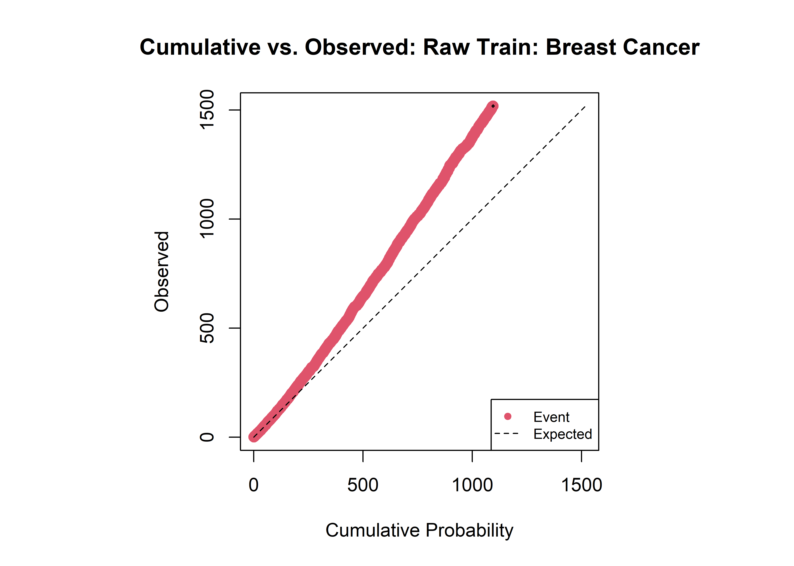
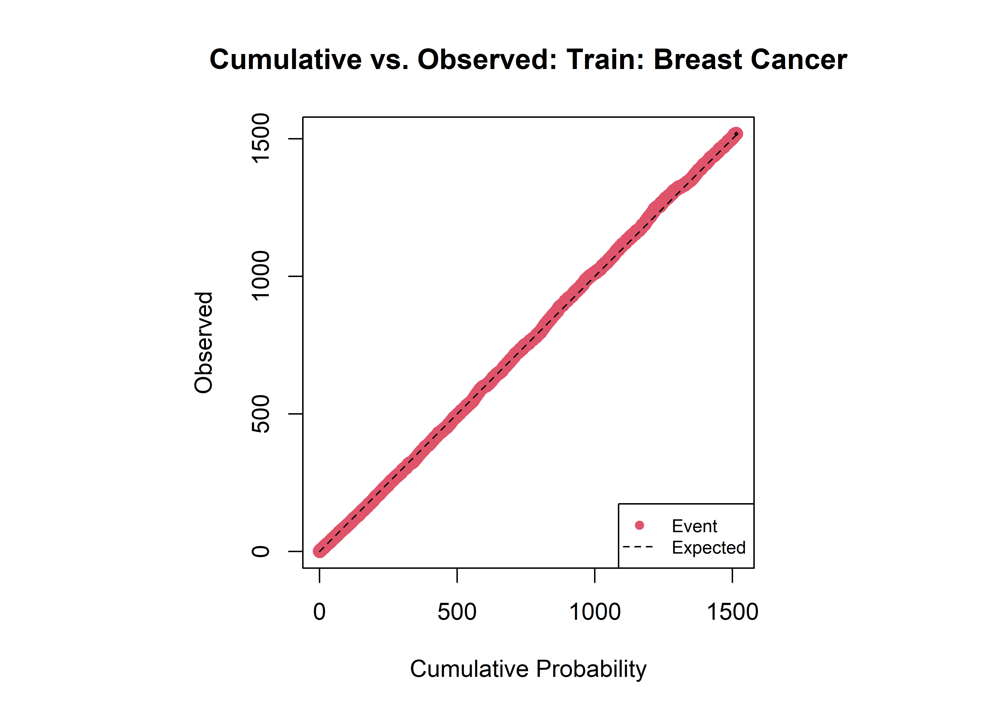
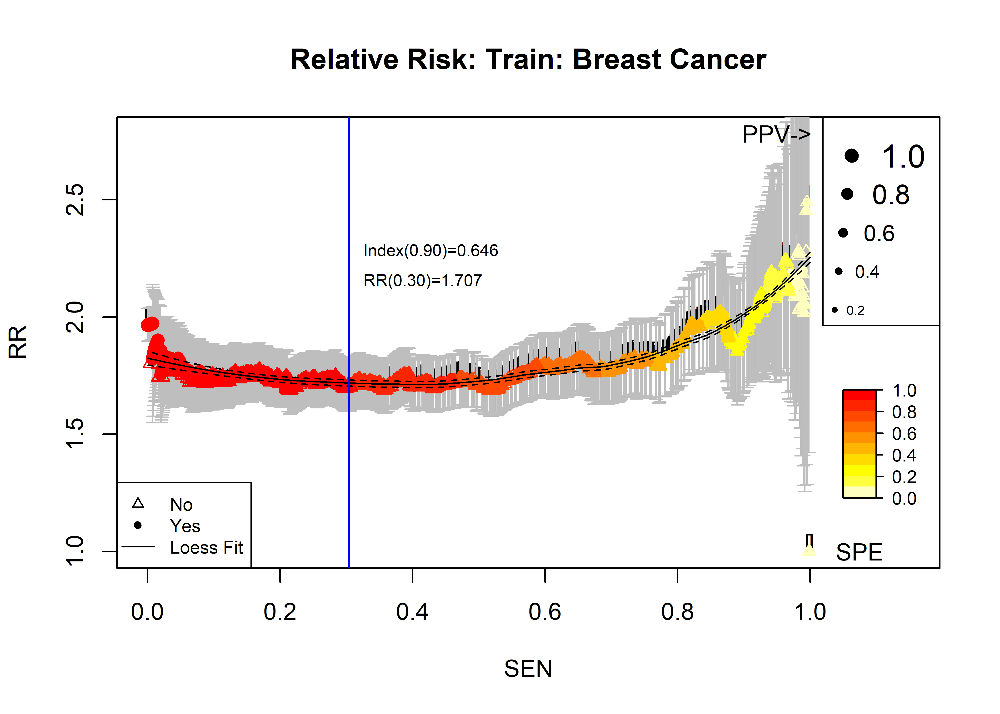
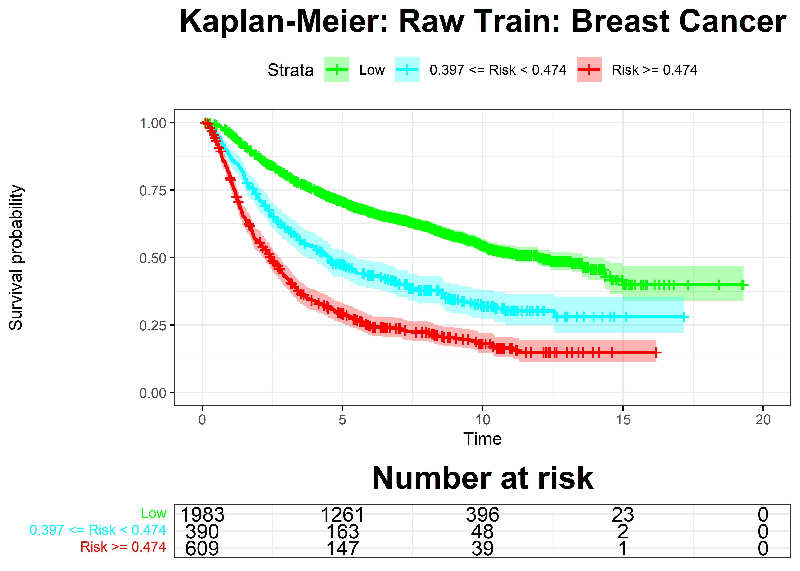

```{r setup, include=FALSE}
knitr::opts_chunk$set(echo = TRUE)
```

# Evaluation of RISK survival models

This document highlights the use of

-   RRPlot(),

-   CoxRiskCalibration(), and

-   CalibrationProbPoissonRisk,

for the evaluation (RRPlot), and calibration of cox models (CoxRiskCalibration) or logistic models (CalibrationProbPoissonRisk) of survival data.

Furthermore, it can be used to evaluate any Risk index that reruns the probability of a future event on external data-set.

This document will use the survival::rotterdam, and survival::gbsg data-sets to train and predict the risk of cancer recurrence after surgery. Both Cox and Logistic models will be trained and evaluated.

Here are some sample plots returned by the evaluated functions:

{width="281"}

{width="278"}





## The libraries

```{r}
library(survival)
library(FRESA.CAD)
source("~/GitHub/FRESA.CAD/R/RRPlot.R")
source("~/GitHub/FRESA.CAD/R/PoissonEventRiskCalibration.R")
op <- par(no.readonly = TRUE)
pander::panderOptions('digits', 3)
pander::panderOptions('table.split.table', 400)
pander::panderOptions('keep.trailing.zeros',TRUE)

```

## Breast Cancer Royston-Altman data

### survival::rotterdam conditioning

```{r results = "asis"}
gbsgdata <- gbsg
rownames(gbsgdata) <- gbsgdata$pid
gbsgdata$pid <- NULL

odata <-rotterdam
rownames(odata) <- odata$pid
odata$pid <- NULL
odata$rfstime <- odata$rtime
odata$status <- odata$recur
odata$rtime <- NULL
odata$recur <- NULL

odata <- odata[,colnames(odata) %in% colnames(gbsgdata)]

odata$size <- 10*(odata$size=="<=20") + 
  35*(odata$size=="20-50") + 
  60*(odata$size==">50")

data <- as.data.frame(model.matrix(Surv(rfstime,status)~.*.,odata))

data$`(Intercept)` <- NULL

dataBrestCancerTrain <- cbind(time=odata[rownames(data),"rfstime"],status=odata[rownames(data),"status"],data)

colnames(dataBrestCancerTrain) <-str_replace_all(colnames(dataBrestCancerTrain),":","_")
colnames(dataBrestCancerTrain) <-str_replace_all(colnames(dataBrestCancerTrain)," ","")
colnames(dataBrestCancerTrain) <-str_replace_all(colnames(dataBrestCancerTrain),"\\.","_")
colnames(dataBrestCancerTrain) <-str_replace_all(colnames(dataBrestCancerTrain),"-","_")
colnames(dataBrestCancerTrain) <-str_replace_all(colnames(dataBrestCancerTrain),">","_")
dataBrestCancerTrain$time <- dataBrestCancerTrain$time/365 ## To years


pander::pander(table(odata[rownames(data),"status"]),caption="rotterdam")


```

### The survival::gbsg data conditioning

```{r results = "asis"}

gbsgdata <- gbsgdata[,colnames(odata)]
data <- as.data.frame(model.matrix(Surv(rfstime,status)~.*.,gbsgdata))

data$`(Intercept)` <- NULL

dataBrestCancerTest <- cbind(time=gbsgdata[rownames(data),"rfstime"],status=gbsgdata[rownames(data),"status"],data)

colnames(dataBrestCancerTest) <-str_replace_all(colnames(dataBrestCancerTest),":","_")
colnames(dataBrestCancerTest) <-str_replace_all(colnames(dataBrestCancerTest)," ","")
colnames(dataBrestCancerTest) <-str_replace_all(colnames(dataBrestCancerTest),"\\.","_")
colnames(dataBrestCancerTest) <-str_replace_all(colnames(dataBrestCancerTest),"-","_")
colnames(dataBrestCancerTest) <-str_replace_all(colnames(dataBrestCancerTest),">","_")
dataBrestCancerTest$time <- dataBrestCancerTest$time/365

pander::pander(table(odata[rownames(data),"status"]), caption="gbsg")


```

## Cox Modeling

```{r results = "asis"}

ml <- BSWiMS.model(Surv(time,status)~.,data=dataBrestCancerTrain,loops=0)
sm <- summary(ml)
pander::pander(sm$coefficients)
```

## Cox Model Performance

Here we evaluate the model using the RRPlot() function.

### The evaluation of the raw Cox model with RRPlot()

Here we will use the predicted event probability assuming a baseline hazard for events withing 5 years

```{r results = "asis", warning = FALSE , dpi=300, fig.height= 5.0, fig.width= 7.0}

index <- predict(ml,dataBrestCancerTrain)
timeinterval <- 5 # Five years

h0 <- sum(dataBrestCancerTrain$status & dataBrestCancerTrain$time < timeinterval)
h0 <- h0/nrow(subset(dataBrestCancerTrain,time > timeinterval | status==1))

rdata <- cbind(dataBrestCancerTrain$status,ppoisGzero(index,h0))

rrAnalysisTrain <- RRPlot(rdata,atProb=c(0.90,0.80),
                     timetoEvent=dataBrestCancerTrain$time,
                     title="Raw Train: Breast Cancer",
                     ysurvlim=c(0.00,1.0),
                     riskTimeInterval=timeinterval)

```

As we can see the Observed probability as well as the Time vs. Events are not calibrated.

### Analyzing RRPlot() outputs

```{r results = "asis"}

pander::pander(t(rrAnalysisTrain$OERatio),caption="O/E Ratio")
pander::pander(t(rrAnalysisTrain$ROCAnalysis$aucs),caption="ROC AUC")
pander::pander((rrAnalysisTrain$ROCAnalysis$sensitivity),caption="Sensitivity")
pander::pander((rrAnalysisTrain$ROCAnalysis$specificity),caption="Specificity")
pander::pander(rrAnalysisTrain$c.index,caption="C. Index")
pander::pander(t(rrAnalysisTrain$thr_atP),caption="Probability Thresholds")
pander::pander(t(rrAnalysisTrain$RR_atP),caption="Risk Ratio")
pander::pander(rrAnalysisTrain$sufdif,caption="Logrank test")

```

### Cox Calibration

```{r results = "asis", warning = FALSE , dpi=300, fig.height= 5.0, fig.width= 7.0}
op <- par(no.readonly = TRUE)


calprob <- CoxRiskCalibration(ml,dataBrestCancerTrain,"status","time")

pander::pander(c(h0=calprob$h0,
                 Gain=calprob$hazardGain,
                 DeltaTime=calprob$timeInterval),
               caption="Cox Calibration Parameters")

```

### The RRplot() of the calibrated model

```{r results = "asis",warning = FALSE , dpi=300, fig.height= 5.0, fig.width= 7.0}
h0 <- calprob$h0
timeinterval <- calprob$timeInterval;

rdata <- cbind(dataBrestCancerTrain$status,calprob$prob)


rrAnalysisTrain <- RRPlot(rdata,atProb=c(0.90,0.80),
                     timetoEvent=dataBrestCancerTrain$time,
                     title="Train: Breast Cancer",
                     ysurvlim=c(0.00,1.0),
                     riskTimeInterval=timeinterval)

```

### Analyzing RRPlot() outputs of the calibrated model

```{r results = "asis"}

pander::pander(t(rrAnalysisTrain$OERatio),caption="O/E Ratio")
pander::pander(t(rrAnalysisTrain$ROCAnalysis$aucs),caption="ROC AUC")
pander::pander((rrAnalysisTrain$ROCAnalysis$sensitivity),caption="Sensitivity")
pander::pander((rrAnalysisTrain$ROCAnalysis$specificity),caption="Specificity")
pander::pander(rrAnalysisTrain$c.index,caption="C. Index")
pander::pander(t(rrAnalysisTrain$thr_atP),caption="Probability Thresholds")
pander::pander(t(rrAnalysisTrain$RR_atP),caption="Risk Ratio")
pander::pander(rrAnalysisTrain$sufdif,caption="Logrank test")

```

## Performance on the external data set

```{r results = "asis", warning = FALSE, dpi=300, fig.height= 5.0, fig.width= 7.0}

index <- predict(ml,dataBrestCancerTest)
pp <- predictionStats_binary(cbind(dataBrestCancerTest$status,index),plotname="Breast Cancer")
par(op)


prob <- ppoisGzero(index,h0)
rdata <- cbind(dataBrestCancerTest$status,prob)
rrAnalysis <- RRPlot(rdata,atThr=rrAnalysisTrain$thr_atP,
                     timetoEvent=dataBrestCancerTest$time,
                     title="Test: Breast Cancer",
                     ysurvlim=c(0.00,1.0),
                     riskTimeInterval=timeinterval)

par(op)

```

### The Evaluation results of validation data set

```{r results = "asis"}
pander::pander(t(rrAnalysis$OERatio),caption="O/E Ratio")
pander::pander(t(rrAnalysis$ROCAnalysis$aucs),caption="ROC AUC")
pander::pander((rrAnalysis$ROCAnalysis$sensitivity),caption="Sensitivity")
pander::pander((rrAnalysis$ROCAnalysis$specificity),caption="Specificity")
pander::pander(rrAnalysis$c.index,caption="C. Index")
pander::pander(t(rrAnalysis$thr_atP),caption="Probability Thresholds")
pander::pander(t(rrAnalysis$RR_atP),caption="Risk Ratio")
pander::pander(rrAnalysis$sufdif,caption="Logrank test")

```

### Calibrating the index on the test data

```{r results = "asis", warning = FALSE , dpi=300, fig.height= 5.0, fig.width= 7.0}

calprob <- CoxRiskCalibration(ml,dataBrestCancerTest,"status","time")

rdata <- cbind(dataBrestCancerTest$status,calprob$prob)

rrAnalysis <- RRPlot(rdata,atProb=c(0.90,0.80),
                     timetoEvent=dataBrestCancerTest$time,
                     title="Recalibrated Test: Breast Cancer",
                     ysurvlim=c(0.00,1.0),
                     riskTimeInterval=calprob$timeInterval)

```

### The Evaluation results of calibrated model on test data set

```{r results = "asis"}

pander::pander(t(rrAnalysis$OERatio),caption="O/E Ratio")
pander::pander(t(rrAnalysis$ROCAnalysis$aucs),caption="ROC AUC")
pander::pander((rrAnalysis$ROCAnalysis$sensitivity),caption="Sensitivity")
pander::pander((rrAnalysis$ROCAnalysis$specificity),caption="Specificity")
pander::pander(rrAnalysis$c.index,caption="C. Index")
pander::pander(t(rrAnalysis$thr_atP),caption="Probability Thresholds")
pander::pander(t(rrAnalysis$RR_atP),caption="Risk Ratio")
pander::pander(rrAnalysis$sufdif,caption="Logrank test")

```

## Logistic Model

Here we train a logistic model on the same data set

```{r results = "asis", warning = FALSE , dpi=300, fig.height= 5.0, fig.width= 7.0}

## Only label subjects that present event withing five years

dataBrestCancerR <- subset(dataBrestCancerTrain, time>=5 | status==1)
dataBrestCancerR$status <- dataBrestCancerR$status * (dataBrestCancerR$time < 5)
dataBrestCancerR$time <- NULL

ml <- BSWiMS.model(status~1,data=dataBrestCancerR,loops=0)

sm <- summary(ml)
pander::pander(sm$coefficients)

```

## Logistic Model Performance

```{r results = "asis", warning = FALSE , dpi=300, fig.height= 5.0, fig.width= 7.0}
op <- par(no.readonly = TRUE)

## No-calibrated
rdata <- cbind(dataBrestCancerTrain$status,predict(ml,dataBrestCancerTrain))
rrAnalysisTrain <- RRPlot(rdata,atProb=c(0.90,0.80),
                     timetoEvent=dataBrestCancerTrain$time,
                     title="Logistic Train: Breast Cancer",
                     ysurvlim=c(0.00,1.0),
                     riskTimeInterval=5.0)
par(op)


```

### The Evaluaiton of the training

```{r results = "asis"}

pander::pander(t(rrAnalysisTrain$OERatio),caption="O/E Ratio")
pander::pander(t(rrAnalysisTrain$ROCAnalysis$aucs),caption="ROC AUC")
pander::pander((rrAnalysisTrain$ROCAnalysis$sensitivity),caption="Sensitivity")
pander::pander((rrAnalysisTrain$ROCAnalysis$specificity),caption="Specificity")
pander::pander(rrAnalysisTrain$c.index,caption="C. Index")
pander::pander(t(rrAnalysisTrain$thr_atP),caption="Probability Thresholds")
pander::pander(t(rrAnalysisTrain$RR_atP),caption="Risk Ratio")
pander::pander(rrAnalysisTrain$sufdif,caption="Logrank test")

```

### Results on the validation set using Logistic model

```{r results = "asis", warning = FALSE , dpi=300, fig.height= 5.0, fig.width= 7.0}
pre <- predict(ml,dataBrestCancerTest)
rdata <- cbind(dataBrestCancerTest$status,pre)

rrAnalysis <- RRPlot(rdata,atThr=rrAnalysisTrain$thr_atP,
                     timetoEvent=dataBrestCancerTest$time,
                     title="Logistic Test: Breast Cancer",
                     ysurvlim=c(0.00,1.0),
                     riskTimeInterval=5)

par(op)

```

### The evaluation of the validation

```{r results = "asis"}

pander::pander(t(rrAnalysis$OERatio),caption="O/E Ratio")
pander::pander(t(rrAnalysis$ROCAnalysis$aucs),caption="ROC AUC")
pander::pander((rrAnalysis$ROCAnalysis$sensitivity),caption="Sensitivity")
pander::pander((rrAnalysis$ROCAnalysis$specificity),caption="Specificity")
pander::pander(rrAnalysis$c.index,caption="C. Index")
pander::pander(t(rrAnalysis$thr_atP),caption="Probability Thresholds")
pander::pander(t(rrAnalysis$RR_atP),caption="Risk Ratio")
pander::pander(rrAnalysis$sufdif,caption="Logrank test")

```

## Logistic Model Poisson Calibration

```{r results = "asis", warning = FALSE , dpi=300, fig.height= 5.0, fig.width= 7.0}

riskdata <- cbind(dataBrestCancerTrain$status,predict(ml,dataBrestCancerTrain),dataBrestCancerTrain$time)
calprob <- CalibrationProbPoissonRisk(riskdata)

timeinterval <- calprob$timeInterval;
gain <- calprob$hazardGain

rdata <- cbind(dataBrestCancerTrain$status,calprob$prob)


rrAnalysisTrain <- RRPlot(rdata,atProb=c(0.90,0.80),
                     timetoEvent=dataBrestCancerTrain$time,
                     title="Adj Logistic Train: Breast Cancer",
                     ysurvlim=c(0.00,1.0),
                     riskTimeInterval=timeinterval)


par(op)


```

### The Evaluaiton of the calibrated logistic: training

```{r results = "asis"}

pander::pander(t(rrAnalysisTrain$OERatio),caption="O/E Ratio")
pander::pander(t(rrAnalysisTrain$ROCAnalysis$aucs),caption="ROC AUC")
pander::pander((rrAnalysisTrain$ROCAnalysis$sensitivity),caption="Sensitivity")
pander::pander((rrAnalysisTrain$ROCAnalysis$specificity),caption="Specificity")
pander::pander(rrAnalysisTrain$c.index,caption="C. Index")
pander::pander(t(rrAnalysisTrain$thr_atP),caption="Probability Thresholds")
pander::pander(t(rrAnalysisTrain$RR_atP),caption="Risk Ratio")
pander::pander(rrAnalysisTrain$sufdif,caption="Logrank test")

```

```{r results = "asis", warning = FALSE , dpi=300, fig.height= 5.0, fig.width= 7.0}
probLog <- predict(ml,dataBrestCancerTest)
aprob <- adjustProb(probLog,gain)

rdata <- cbind(dataBrestCancerTest$status,aprob)
rrAnalysis <- RRPlot(rdata,atThr=rrAnalysisTrain$thr_atP,
                     timetoEvent=dataBrestCancerTest$time,
                     title="Adj Logistic Test: Breast Cancer",
                     ysurvlim=c(0.00,1.0),
                     riskTimeInterval=timeinterval)

```

### The evaluation of the calibrated validation

```{r results = "asis"}

pander::pander(t(rrAnalysis$OERatio),caption="O/E Ratio")
pander::pander(t(rrAnalysis$ROCAnalysis$aucs),caption="ROC AUC")
pander::pander((rrAnalysis$ROCAnalysis$sensitivity),caption="Sensitivity")
pander::pander((rrAnalysis$ROCAnalysis$specificity),caption="Specificity")
pander::pander(rrAnalysis$c.index,caption="C. Index")
pander::pander(t(rrAnalysis$thr_atP),caption="Probability Thresholds")
pander::pander(t(rrAnalysis$RR_atP),caption="Risk Ratio")
pander::pander(rrAnalysis$sufdif,caption="Logrank test")

```
