# RISKPLOTS

This repository showcases the use of the `FRESA.CAD::RRplots()` function for the evaluation, and extraction of high-risk thresholds for biomarkers, prognosis indexes, and any other continuous variable associated with the risk of future events.

The function was built to answer the following questions:

-   **Biomarkers**:

    -   Is a continuous biomarker useful for the prognosis of future events?

        -   Can a continuous biomarker can be used to stratify high-risk, low-risk populations?

            -   What is the threshold that can achieve that stratification?

        -   How do High-Middle and low-Risk survival curves behave?

-   **Risk probabilities and Risk Models**

    -   Are the probabilities of the risk to future events in a given time interval calibrated?

        -   Do the probability of the event matches the observed events?

        -   What is the Decision Curve Analysis between censored and non-censored events?

        -   Do the observed events are occurring as predicted by the risk hazards?

    -   What is the threshold for identifying high-risk subjects?

        -   What is the Hazard ratios between High-risk subjects and the other population?

        -   What is the ROC curve and its significance?

    -   Do the Kaplan-Meier plots are different between at-risk stratified subjects?

        -   What is the level of significance?

If the probability of risk is not well calibrated FRESA.CAD provides the following functions to adjust the index probabilities to match the observed rate of events.

-   `FRESA.CAD::CoxRiskCalibration()`

-   `FRESA.CAD::CalibrationProbPoissonRisk()`

The first was designed to calibrate the probabilities of a COX model, the second was designed to calibrate the probabilities of risk to future events in a given time interval. Both functions will return the baseline hazard that best describes the data as well as the best time interval required to match the rate of observed events. Hence `CalibrationProbPoissonRisk()` can be applied to any methodology that returns either the prognostic indexes, hazard ratios, or the probability of the event in a time interval.

## Required Library

RRPlots is implemented in FRESA.CAD. You can get the latest version from GitHub:

``` r
install_github("joseTamezPena/FRESA.CAD")
```

### Sample RMD code

The CODE directory has the following files:

-   `CODE/BreastCancerRoyAltman.Rmd`

-   `CODE/BreastCancerShort.Rmd`

-   `CODE/Colon.Rmd`

-   `CODE/flchain.Rmd`

-   `CODE/LungCancer.Rmd`

-   `CODE/BreastCancer.Rmd`

They provided sample scripts to estimate risk indexes as well as how to evaluate their behavior and how to calibrate them.

## Usage

`{\usage}   ## This is a sample call.    pinfo <- RRPlot(riskData=cbind(status,probofEvent),     timetoEvent=timesToEvent,     riskTimeInterval=1,     ExpectedPrevalence=NULL,     atRate=c(0.90,0.80),     atThr=NULL,     title="Dummy",     ysurvlim=c(0,1.0)     )`

An actual run of the code is at: CODE/BreastCancerRoyAltman.Rmd

The output is at: <https://rpubs.com/J_Tamez/RRPlotSurvival>

### The Main Inputs

`-riskData`

The RRplots will assume that the input data (`riskData`) is a two-column R data frame. The first column will have the censoring information, i.e., {0: No event, 1: True event} The second column will have the probability of observing at least one event in the time interval ($\Delta t$). Internally the function will assume that the Poisson distribution models the probability of observing k events. Hence:

$$
p(k>0)=1.0-e^{-\lambda},
$$

where $\lambda$ is the average number of events within the time interval. $p(k>0)$ will estimate the probability of observing at least one event in the time interval.

If the user models the risk by Cox modeling, then $\lambda$ is:

$$
\lambda= h_0e^{X \cdot \beta},
$$

where $h_0$ is the baseline hazard, $X$ is the vector of risk factors, and $\beta$ is the vector of risk coefficients. Most of the time Cox models only return the prognosis index (PI), and PI= $X \cdot \beta$. The user must provide an estimation of the baseline hazard to estimate the probability of the event for Cox models. FRESA.CAD provides the function `ppoisGzero(index,h0)` to compute the probability of an event given the linear estimations returned by the Cox model.

`-timetoEvent`

If the user provides the `timetoEvent` vector with the times to event to the RRPlot function, then the expected number of events per time interval will be estimated by:

$$
\lambda=-log[1.0-p(k>0)],
$$

and

$$
\textrm{Expected Events}=t \lambda /\Delta t,
$$

where $t$ is the actual time to event and $\Delta t$ is the time interval. Hence the function will accumulate all average events per time interval to estimate the number of observed events within the provided times to event.

`-riskTimeInterval`

To estimate the number of observed events in the spanned time provided by `timetoEvent` vector. All the observed times are divided by the user-provided information in the `riskTimeInterval` input. i.e `riskTimeInterval` = $\Delta t$

`-atRate`

This input parameter specifies the (True Negative Rate (TNR o Specificity) or False Negative Rate (TNR or 1-Specificity) required to automatically define the risk groups. The default values are (0.9,0.8) which implies that the described threshold for high risk will only FPR of 10% of the at not risk subjects. The intermediate risk will be the next 10% of the subjects not at risk. The low-risk category will include 80% of the subjects that did not have the event. If the `atRate` values are lower than 0.5 The function will assume that the user is specifying the desired False Negative Rate (FNR or 1.0-specificity)

`-atThr`

This parameter defines the actual thresholds to define the at-risk categories.

### The Outputs

The `RRPlot()` will return the following six plots:

1.  Accumulated Probability vs Observed Events: Calibrated probabilities will follow the identity line.

    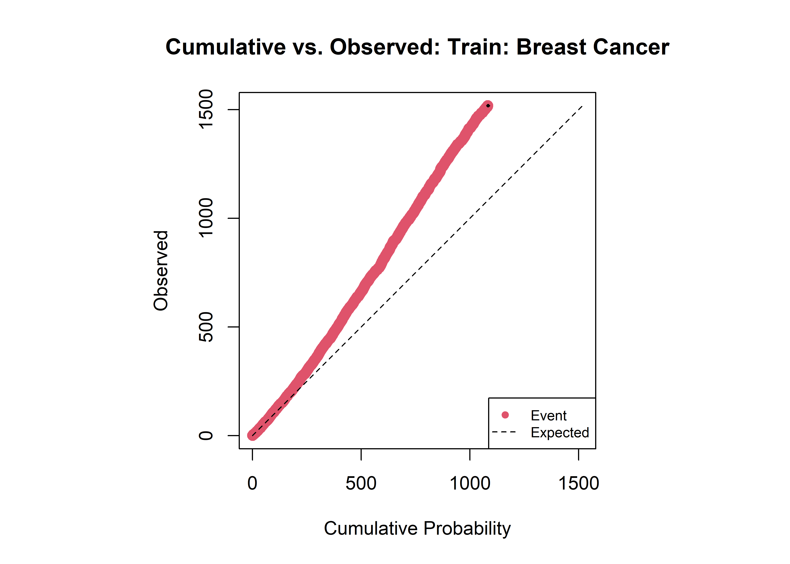{width="310"}

    This plot indicates that the risk probabilities are off and the observed events are happening at a higher rate than predicted.

2.  Decision Curve Analysis: An indication of the power to make an informed treatment decision for each threshold value based on the provided probabilities.

    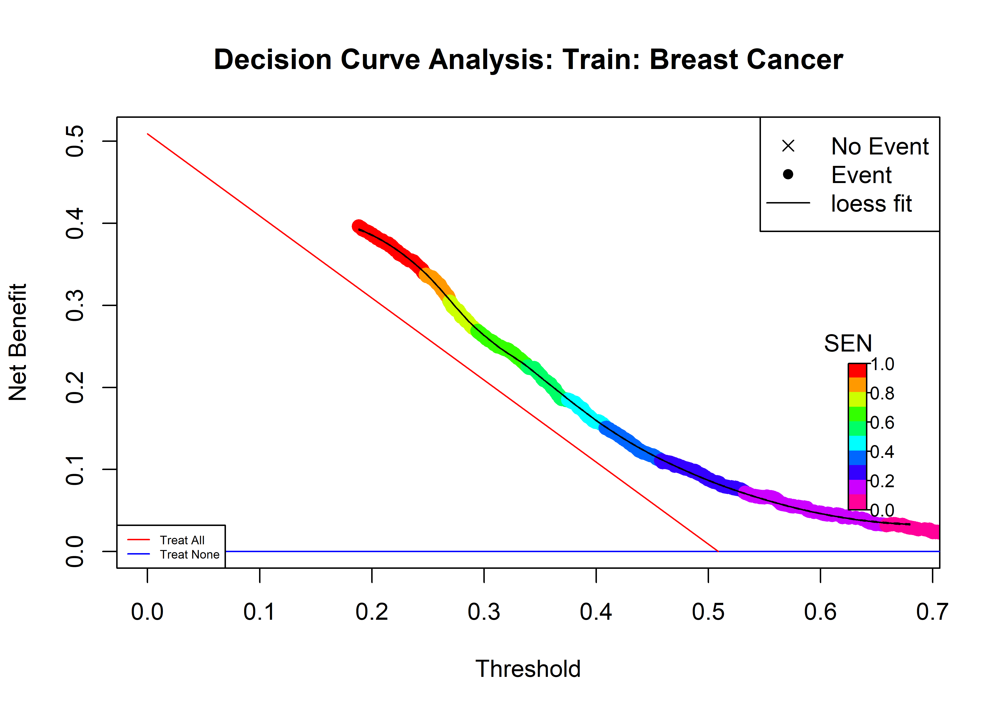{width="318"}

    The Decision Curve Analysis indicates how good are the probabilities to predict a true event from a censured event. Also, give us an indication of how accurate are those probabilities to take action based on the returned probabilities. As long as the sensitivity curve is above the two lines: {Treat All, do Nothing) the risk values have a net benefit.

3.  Relative Risk Analysis: An analysis of the effect of deciding a specific threshold of subjects at high risk.

    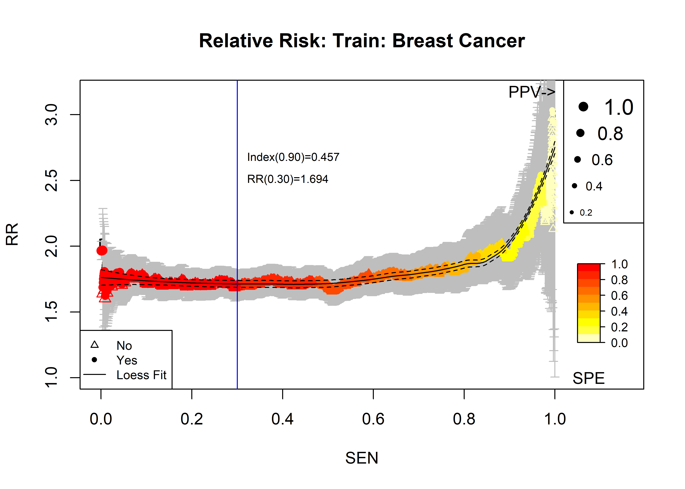{width="353"}

    The Relative Risk plot estimate the Risk Ratios for all possible threshold that dive de population into high-risk and low-risk groups. The heat color codes the sensitivity for each threshold value. The vertical line indicates the user-specified threshold. The dot size is an indication of the Positive predictive value. By looking at this plot, the user can have a glimpse of how good is the provided risk probabilities to benefit a certain group of people.

4.  Receiver Operative Characteristic (ROC): The behavior of the index as a prognosis of true future events vs. censored events (No events)

    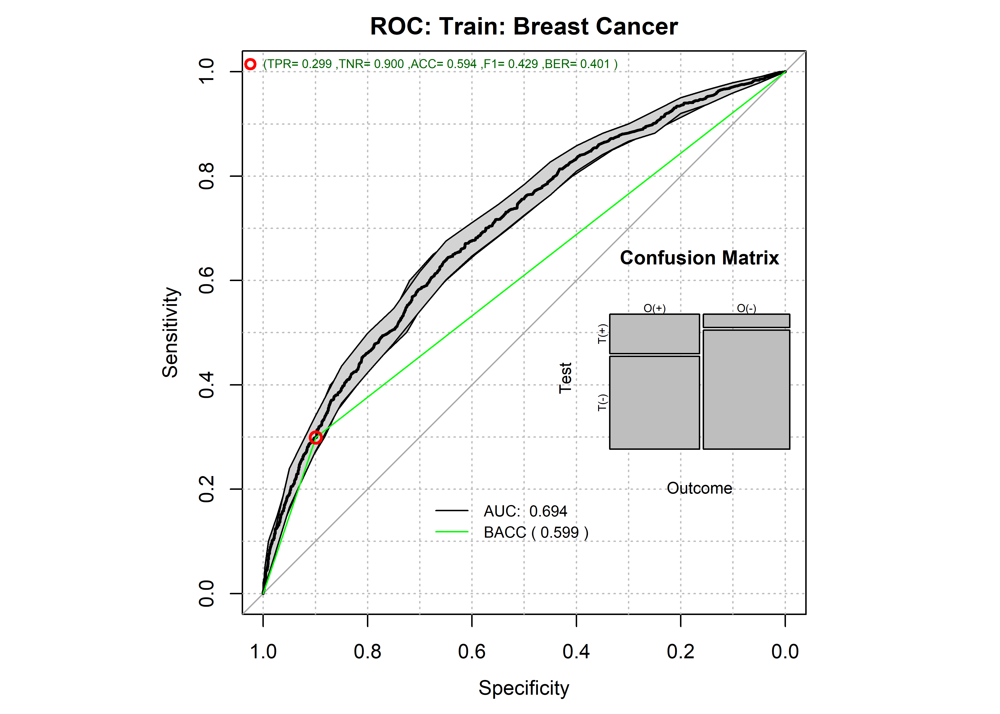

    This ROC plot highlights the behavior of the risk to separate the high-risk vs the low-risk group. The green line and the red dot highlight the location of the automatically computed threshold or the user-provided threshold. The confusion matrix shows the performance at the decision threshold.

5.  Time vs. Events: This shows if the provided probability is calibrated to the observed events. It requires that the user provides an accurate estimation of the time interval.

    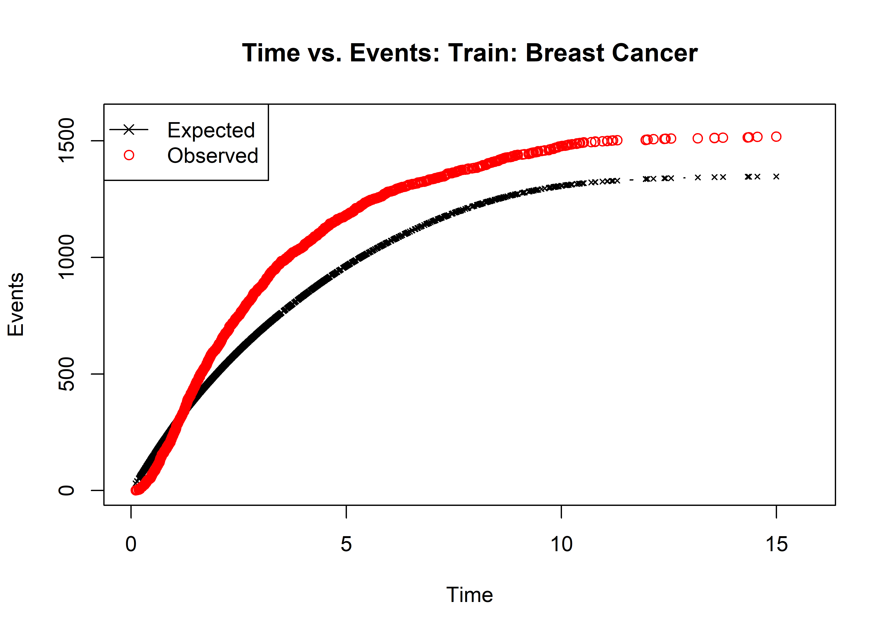{width="314"}

    The Time vs. Events plots shows how close is the actual predicted probability in the given `riskTimeInterval` to predict the observed events. Large deviations from the expected indicate that the risk values or the `riskTimeInterval` are not calibrated.

6.  Kaplan Meier: The standard Kaplan Meier plot of the user-specified at-risk groups.

    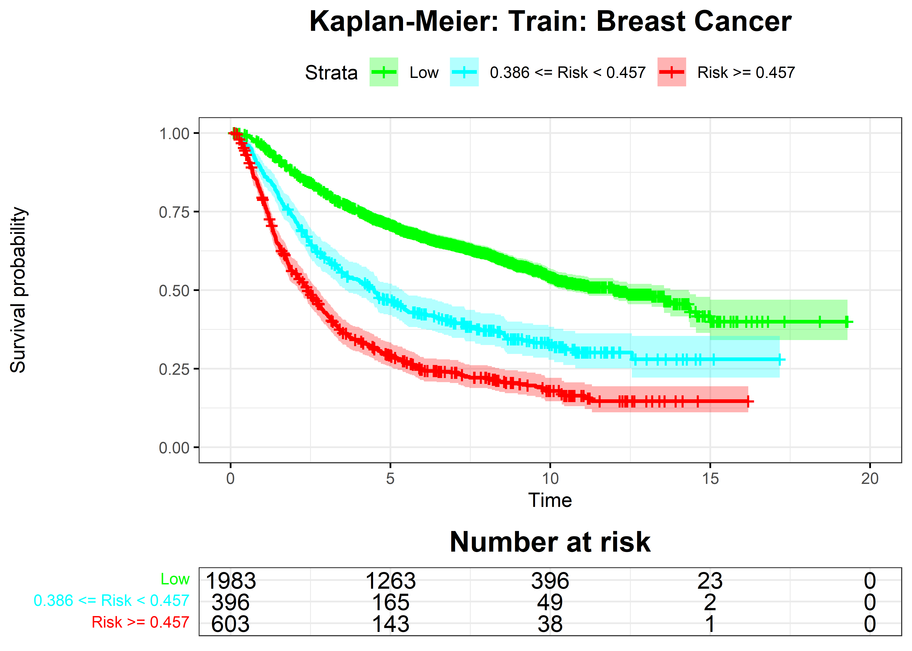{width="318"}

    The Kaplan-Meier plot shows the behavior of the at-risk categories as defined by the `atProb` parameter or `atThr` parameter.

## The quantitative outputs

The `RRPlots()` function returns several quantitative analyses of the risk probabilities. Some of them are:

-   <div>

    Key Threshold values:

    pinfo\$keyPoints

    </div>

    Output:

    |                |        |        |            |          |          |        |
    |----------------|--------|--------|------------|----------|----------|--------|
    |                | \@:0.9 | \@:0.8 | \@MAX_BACC | \@MAX_RR | \@SPE100 | p(0.5) |
    | **Thr**        | 0.459  | 0.389  | 0.320      | 0.214    | 0.18549  | 0.4996 |
    | **RR**         | 1.690  | 1.713  | 1.799      | 2.376    | 1.00000  | 1.7255 |
    | **RR_LCI**     | 1.586  | 1.603  | 1.666      | 1.869    | 0.00000  | 1.6196 |
    | **RR_UCI**     | 1.802  | 1.830  | 1.942      | 3.019    | 0.00000  | 1.8383 |
    | **SEN**        | 0.299  | 0.462  | 0.644      | 0.965    | 1.00000  | 0.2464 |
    | **SPE**        | 0.900  | 0.798  | 0.646      | 0.125    | 0.00137  | 0.9310 |
    | **BACC**       | 0.599  | 0.630  | 0.645      | 0.545    | 0.50068  | 0.5887 |
    | **NetBenefit** | 0.110  | 0.172  | 0.246      | 0.374    | 0.39742  | 0.0916 |

It reports thresholds for user-specified values of sensitivity (\@0.9 and \@0.8). It also reports threshold values for the maximum balanced accuracy (\@MAX_BACC) at the maximum Risk Ratio (\@MAX_RR) and 100% Specificity (\@SPE100) and at p=0.5. (p(0.5)). For each threshold the table reports the Risk Ratios (**RR**), the Lower 95% confidence interval (**RR_LCI**), the upper 95% Confidence interval (**RR_UCI**), the sensitivity (**SEN**), the specificity (**SPE**), the balanced accuracy (**BACC**) and the net benefit (**NetBenefit**)

-   <div>

    The Observed/Expected Ratio using the last observation

    ```         
    pinfo$OERatio
    ```

    </div>

|      |       | O/E Ratio |
|------|-------|-----------|
| est  | lower | upper     |
| 1.13 | 1.07  | 1.19      |

-   <div>

    The mean Observed/Expected Ratio was computed using 95% of the data.

    ```         
    pinforrAnalysisTrain$OE95ci
    ```

    </div>

|      |      |      | O/E Ratio |
|------|------|------|-----------|
| mean | 50%  | 2.5% | 97.5%     |
| 1.13 | 1.13 | 1.12 | 1.14      |

-   <div>

    The Observed/Accumulated probability ratio

    ```         
    pinfo$OAcum95ci
    ```

    </div>

|      |      |      | O/Acum Ratio |
|------|------|------|--------------|
| mean | 50%  | 2.5% | 97.5%        |
| 1.34 | 1.34 | 1.34 | 1.35         |

-   <div>

    The C-Index

    ```         
    pinfo$c.index$cstatCI
    ```

    </div>

| mean.C Index | median | lower | upper |
|--------------|--------|-------|-------|
| 0.677        | 0.677  | 0.662 | 0.691 |

-   <div>

    The ROC AUC

    ```         
    pinfo$ROCAnalysis$aucs
    ```

    </div>

|       |       | ROC AUC |
|-------|-------|---------|
| est   | lower | upper   |
| 0.694 | 0.676 | 0.713   |

-   <div>

    The Sensitivity

    ```         
    pinfo$ROCAnalysis$sensitivity
    ```

    </div>

|     |       | Sensitivity |
|-----|-------|-------------|
| est | lower | upper       |
| 0.3 | 0.277 | 0.324       |

-   <div>

    The Specificity

    ```         
    pinfo$ROCAnalysis$specificity
    ```

    </div>

|     |       | Specificity |
|-----|-------|-------------|
| est | lower | upper       |
| 0.9 | 0.883 | 0.915       |

-   <div>

    The thresholds used to stratify the population into risk groups

    ```         
    pinfo$thr_atP
    ```

    </div>

|       | Probability Thresholds |
|-------|------------------------|
| 90%   | 80%                    |
| 0.457 | 0.386                  |

-   <div>

    The Risk Ratio between High-Risk and the rest

    ```         
    pinfo$RR_atP
    ```

    </div>

|      |       | Risk Ratio |
|------|-------|------------|
| est  | lower | upper      |
| 1.69 | 1.59  | 1.81       |

-   <div>

    The Logrank test analysis via de survdif procedure

    ```         
    pinfo$surdif
    ```

    </div>

|             |      |          |          |            | Logrank test Chisq = 479.123919 on 2 degrees of freedom, p = 0.000000 |
|-------------|------|----------|----------|------------|-----------------------------------------------------------------------|
|             | N    | Observed | Expected | (O-E)\^2/E | (O-E)\^2/V                                                            |
| **class=0** | 1983 | 812      | 1145     | 96.7       | 398.2                                                                 |
| **class=1** | 396  | 250      | 177      | 29.6       | 33.6                                                                  |
| **class=2** | 603  | 456      | 196      | 345.4      | 401.8                                                                 |

## Calibrating Risk Predictions

FRESA.CAD provides two functions to calibrate risk probabilities.

The first option is:

```         
calprob <- CoxRiskCalibration(coxModel,dataset,"status","time")
```

The `CoxRiskCalibration()` function takes a Cox model to estimate the probabilities on the provided data set. The status parameter as the time parameter defines the columns that have the censoring status and the time to event information. In return, the method provides the calibrated probabilities as well as the baseline hazard, and the time interval that best describes the observed events. This is the result of calibrating the original probabilities.

```         
timeinterval <- calprob$timeInterval;
rdata <- cbind(data$status,calprob$prob)
rrAnalysisTrain <- RRPlot(rdata,atProb=c(0.90,0.80),
                     timetoEvent=data$time,
                     title="Cal. Logistic Train: Breast Cancer",
                     ysurvlim=c(0.00,1.0),
                     riskTimeInterval=timeinterval)
```

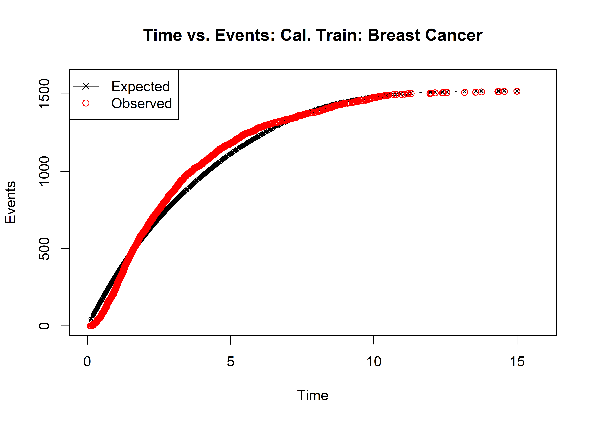](images/paste-6EE76927.png)

The second method takes the predicted probabilities

```         
calprob <- CalibrationProbPoissonRisk(riskdata)
```

where risk data is:

```         
riskdata <- cbind(data$status,predict(mlog,data),data$time)
calprob <- CalibrationProbPoissonRisk(riskdata)
timeinterval <- calprob$timeInterval;
rdata <- cbind(dataBrestCancerTrain$status,calprob$prob)


rrAnalysisTrain <- RRPlot(rdata,atProb=c(0.90,0.80),
                     timetoEvent=data$time,
                     title="Cal. Logistic Train: Breast Cancer",
                     ysurvlim=c(0.00,1.0),
                     riskTimeInterval=timeinterval)
```

The predict function must return the probability of the event. After calibration, the returned probabilities should match the observed events. 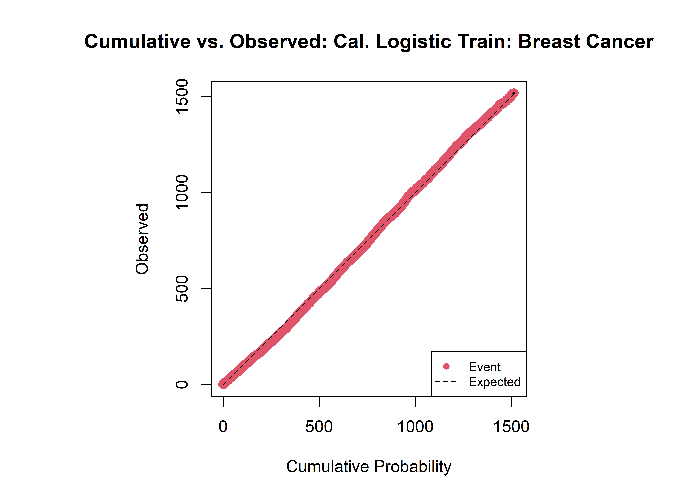

## 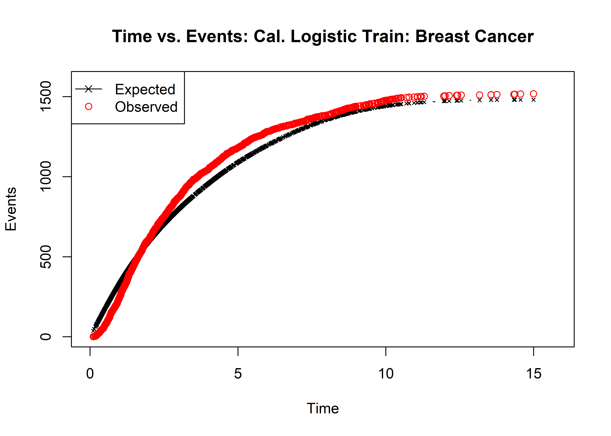

Comparing the performance of two risk models

You can compare two risk prob. The returned outputs of the RRPlot() function have the `CumulativeOvs`, and the `OEData` dataframes. These dataframes stored the Accumulated Observed Events as well as the Accumulated probability or Accumulated expected events. i.e.

-   pinfo\$CumulativeOvs

-   pinfo\$OEData

Can be used to compare the risk probabilities of two models: Here is a sample code to compare the returned outputs of Cox and Logistic models on data.

```         
maxobs <- sum(dataBrestCancerTest$status)

par(mfrow=c(1,2),cex=0.75)

plot(rrCoxTestAnalysis$CumulativeOvs,type="l",lty=1,
     main="Cumulative Probability",
     xlab="Observed",
     ylab="Cumulative Probability",
     ylim=c(0,maxobs),
     xlim=c(0,maxobs))
lines(rrAnalysisTestLogistic$CumulativeOvs,lty=2,col="red")
lines(x=c(0,maxobs),y=c(0,maxobs),lty=3,col="gray")
legend("topleft",legend = c("Cox","Logistic","Ideal"),
       col=c("black","red","gray"),
       lty=c(1,2,3),
       cex=0.75
)


plot(rrCoxTestAnalysis$CumulativeOvs$Observed,
     rrCoxTestAnalysis$CumulativeOvs$Cumulative-
       rrCoxTestAnalysis$CumulativeOvs$Observed,
     main="Cumulative Risk Difference",
     xlab="Observed",
     ylab="Cumulative Risk - Observed",
     type="l",
     lty=1)
lines(rrAnalysisTestLogistic$CumulativeOvs$Observed,
     rrAnalysisTestLogistic$CumulativeOvs$Cumulative-
       rrAnalysisTestLogistic$CumulativeOvs$Observed,
     lty=2,
     col="red")
legend("topleft",legend = c("Cox","Logistic"),
       col=c("black","red"),
       lty=c(1,2),
       cex=0.75
)
```

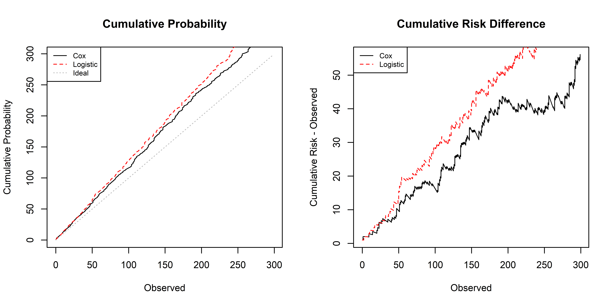

```         
plot(rrCoxTestAnalysis$OEData[,2:3],type="l",lty=1,
     main="Expected over Time",
     xlab="Observed",
     ylab="Expected",
     ylim=c(0,maxobs),
     xlim=c(0,maxobs))
lines(rrAnalysisTestLogistic$OEData[,2:3],lty=2,col="red")
lines(x=c(0,maxobs),y=c(0,maxobs),lty=3,col="gray")
legend("topleft",legend = c("Cox","Logistic","Ideal"),
       col=c("black","red","gray"),
       lty=c(1,2,3),
       cex=0.75
)

plot(rrCoxTestAnalysis$OEData$Observed,
     rrCoxTestAnalysis$OEData$Expected-
       rrCoxTestAnalysis$OEData$Observed,
     main="Expected vs Observed Difference",
     xlab="Observed",
     ylab="Cumulative - Observed",
     type="l",
     lty=1)
lines(rrAnalysisTestLogistic$OEData$Observed,
     rrAnalysisTestLogistic$OEData$Expected-
       rrAnalysisTestLogistic$OEData$Observed,
     lty=2,col="red")

legend("bottomleft",legend = c("Cox","Logistic"),
       col=c("black","red"),
       lty=c(1,2),
       cex=0.75
)
```

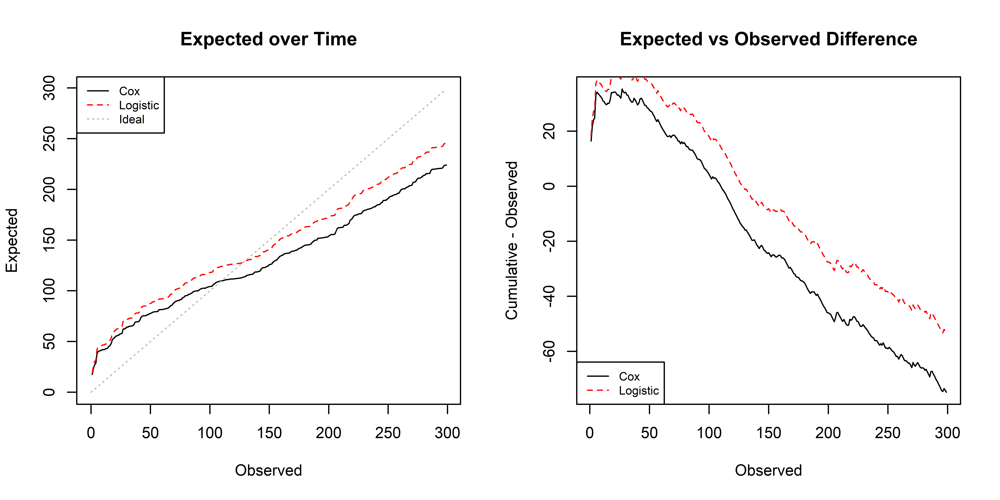
