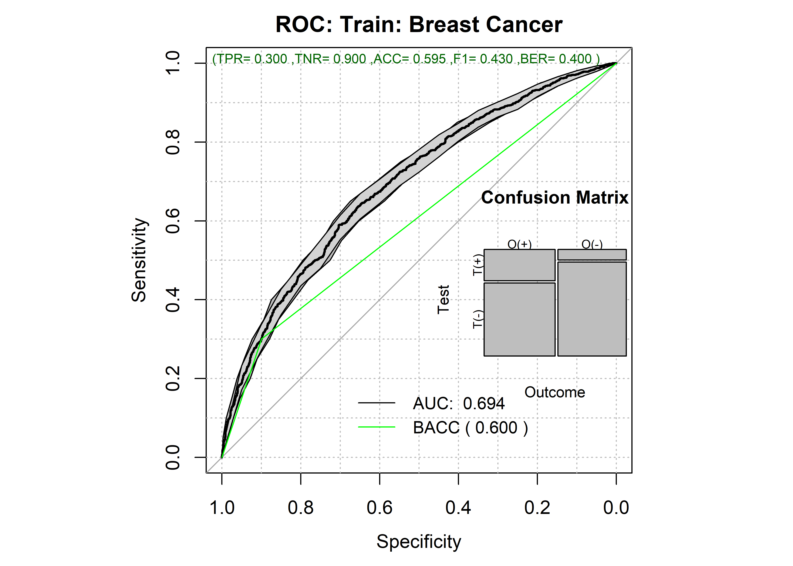

# RISKPLOTS

This repository showcase the use of the `FRESA.CAD::RRplots()` function for the evaluation, and extraction of high risk thresholds for risk indexes of Poisson events.

The function was build to answer the following questions:

-   Are the probabilities of the risk to future events in a given time interval calibrated?

    -   Do the probability of event matches the observed events?

    -   What is the Decision Curve Analysis between censored and non censored events?

    -   Do the observed events are occurring as predicted by the risk hazards?

-   What are the threshold for identifying the high risk subjects?

    -   What is the Hazard ratios between High risk subjects and the other population?

    -   What is the ROC curve and its significance?

-   Do the Kaplan-Meier plots are different between at risk stratified subjects?

    -   What is the level of significance?

If the risk are not calibrated FRESA.CAD provides the following functions to adjust the index probabilities to match the observed rate of events.

-   `FRESA.CAD::CoxRiskCalibration()`

-   `FRESA.CAD::CalibrationProbPoissonRisk()`

The first was designed to calibrate the probabilities of a COX model, the second was designed to calibrate the probabilities of risk to future event in a given time interval. Both functions will return the baseline hazard that best describe the data as well as the best time interval required to match the rate of observed events. Hence `CalibrationProbPoissonRisk()` can be applied to any methodology that returns either the prognostic indexes, hazards ratios or the probability of event in a time interval.

## Usage

``` {\usage}
  ## This is a sample call. 
  pinfo <- RRPlot(riskData=cbind(status,probofEvent),
    timetoEvent=timesToEvent,
    riskTimeInterval=1,
    ExpectedPrevalence=NULL,
    atProb=c(0.90,0.80),
    atThr=NULL,
    title="Dummy",
    ysurvlim=c(0,1.0)
    )
```

An actual run of the code is at: CODE/BreastCancerRoyAltman.Rmd

The output is at: <https://rpubs.com/J_Tamez/RRPlotSurvival>

### The Main Inputs

`-riskData`

The RRplots will assume that the input data (`riskData`) is a two column R data-frame. The first column will have the censoring information, i.e., {0: No event, 1: True event} The second column will have the probability of observing at least one event per time interval ($\Delta t$). Internally the function will assume that the Poisson distribution models the probability of observing k events. Hence:

$$
p(k>0)=1.0-e^{-\lambda},
$$

where $\lambda$ is the average number of events withing time interval, will estimate the probability of observing at least one event in the next time interval.

If the user models the risk by Cox modeling, then $\lambda$ is:

$$
\lambda= h_0e^{X \cdot \beta},
$$

where $h_0$ is the baseline hazard, $X$ are the risk factors, and $\beta$ the risk coefficients. Most of the times Cox models only return the prognosis index (PI), and PI=$X \cdot \beta$. The user must provide an estimation of the baseline hazard to estimate the probability of event for cox models. FRESA.CAD provides the function `ppoisGzero(index,h0)` to compute the probability of an event given the linear estimations returned by the Cox model.

`-timetoEvent`

If the user provides the `timetoEvent` vector with the times to event to the RRPlot function, then the expected number of events per time interval will be estimated by:

$$
\lambda=-log[1.0-p(k>0)],
$$

and

$$
\textrm{Expected Events}=t \lambda /\Delta t,
$$

where $t$ is the actual time to event and $\Delta t$ is the time interval. Hence the function will accumulate all average events per time interval to estimate the number of observed events withing the provided times to event.

`-riskTimeInterval`

To estimate the number of observed events in the spanned time provided by `timetoEvent` vector. All the observed times are divided by the user provided information in the `riskTimeInterval` input. i.e `riskTimeInterval` = $\Delta t$

`-atProb`

This input parameter specifies the specificity required to automaticaly define the risk groups. The default values are: (0.9,0.8) that implies that the described threshold for high risk will only detect as false positives 10% of the at not risk subjects. The intermediate risk will be the next 10% of the subjects not at risk. The low risk category will include 80% of the subjects that did not have the event.

`-atThr`

This parameter defines the actual thresholds to define the at risk categories. The RRPlot() will not do nothing to estimate the risks.

### The Outputs

The `RRPlot()` will return the following six plots:

1.  Accumulated Probability vs Observed Events: Calibrated probabilities will follow the identity line.

    {width="310"}

    This plot indicates that the risk probabilities are off and the observed events are happening at a higher rate than predicted.

2.  Decision Curve Analysis: An indication of the power to make informed treatment benefit based on the returned probabilities.

    {width="318"}

    The Decision Curve Analysis indicates how good are the probabilities to predict a true event from a censured event. Also give us and indication on how accurate are those probabilities to take action based on the returned probabilities. As long as the sensitivity curve is above the two lines: {Treat All, do Nothing) the risk values have a net benefit.

3.  Relative Risk Analysis: An analysis of the effect of deciding a specific threshold of subjects at high risk.

    {width="353"}

    The Relative Risk plot estimate the Risk Ratios for all possible threshold that dive de population into high-risk and low-risk groups. The heat-color codes the sensitivity for each threshold value. The vertical line indicates the user specified threshold. The dot size is an indication of the Positive predictive value. By looking at this plot, the user can have a glimpse of how good is the provided risk probabilities to benefit a certain group of people.

4.  Receiver Operative Characteristic (ROC): The behavior of the index as a prognosis of true future events vs. censored events (No events)

    {width="377"}

    This ROC plot highlights the behavior of the risk to separate the high-risk vs the low-risk group. The green line provides the behavior of the automatically computed threshold or the user provided threshold.

5.  Time vs. Events: Shows if the provided probability is calibrated to the observed events. It requires that the user provides an accurate estimation of the time interval.

    {width="314"}

    The Time vs. Events plots shows how close is the actual predicted probability in the given `riskTimeInterval` to predict the observed events. Large deviations from the expected indicates that the risks values or the `riskTimeInterval` are not calibrated.

6.  Kaplan Meier: The standard Kaplan Meier plot of the user specified at risk groups.

    {width="318"}

    The Kaplan-Meier plot shows the behavior of the at risk categories as defined by the `atProb` parameter or `atThr` parameter.

## The quantitative outputs

The `RRPlots()` function returns several quantitative analysis of the risk probabilities. Some of them are:

-   <div>

        pinfo$OERatio

    </div>

|      |       | O/E Ratio |
|------|-------|-----------|
| est  | lower | upper     |
| 1.13 | 1.07  | 1.19      |

-   <div>

        pinforrAnalysisTrain$OE95ci

    </div>

|      |      |      | O/E Ratio |
|------|------|------|-----------|
| mean | 50%  | 2.5% | 97.5%     |
| 1.13 | 1.13 | 1.12 | 1.14      |

-   <div>

        pinfo$OAcum95ci

    </div>

|      |      |      | O/Acum Ratio |
|------|------|------|--------------|
| mean | 50%  | 2.5% | 97.5%        |
| 1.34 | 1.34 | 1.34 | 1.35         |

-   <div>

        pinfo$c.index$cstatCI

    </div>

| mean.C Index | median | lower | upper |
|--------------|--------|-------|-------|
| 0.677        | 0.677  | 0.662 | 0.691 |

-   <div>

        pinfo$ROCAnalysis$aucs

    </div>

|       |       | ROC AUC |
|-------|-------|---------|
| est   | lower | upper   |
| 0.694 | 0.676 | 0.713   |

-   <div>

        pinfo$ROCAnalysis$sensitivity

    </div>

|     |       | Sensitivity |
|-----|-------|-------------|
| est | lower | upper       |
| 0.3 | 0.277 | 0.324       |

-   <div>

        pinfo$ROCAnalysis$specificity

    </div>

|     |       | Specificity |
|-----|-------|-------------|
| est | lower | upper       |
| 0.9 | 0.883 | 0.915       |

-   <div>

        pinfo$thr_atP

    </div>

|       | Probability Thresholds |
|-------|------------------------|
| 90%   | 80%                    |
| 0.457 | 0.386                  |

-   <div>

        pinfo$RR_atP

    </div>

|      |       | Risk Ratio |
|------|-------|------------|
| est  | lower | upper      |
| 1.69 | 1.59  | 1.81       |

-   <div>

        pinfo$sufdif

    </div>

|             |      |          |          |            | Logrank test Chisq = 479.123919 on 2 degrees of freedom, p = 0.000000 |
|-------------|------|----------|----------|------------|-----------------------------------------------------------------------|
|             | N    | Observed | Expected | (O-E)\^2/E | (O-E)\^2/V                                                            |
| **class=0** | 1983 | 812      | 1145     | 96.7       | 398.2                                                                 |
| **class=1** | 396  | 250      | 177      | 29.6       | 33.6                                                                  |
| **class=2** | 603  | 456      | 196      | 345.4      | 401.8                                                                 |
